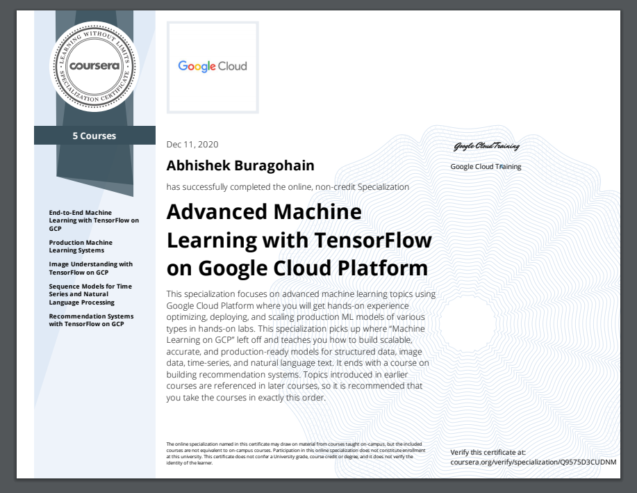

# Advance_Machine_Learning_Google_Cloud
Coursera specializations Projects

Please follow the follwing steps first: 
```
git clone https://github.com/GoogleCloudPlatform/training-data-analyst
cd training-data-analyst > courses > machine_learning >
```
 

## COURSE 1
End-to-End Machine Learning with TensorFlow on GCP


## COURSE 2
Production Machine Learning Systems


## COURSE 3
Image Understanding with TensorFlow on GCP


## COURSE 4

Sequence Models for Time Series and Natural Language Processing

## COURSE 5
Recommendation Systems with TensorFlow on GCP

